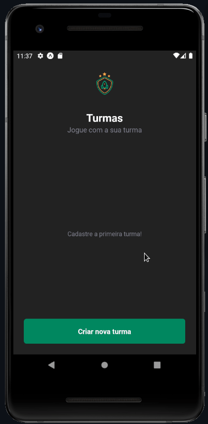

# Game Teams App

An app for the management of classes and players from the classes for playathons.


### What's inside?


<div align="left" width="50%">
  
### Installation Guide

Requirements
- [NodeJS LTS](https://nodejs.org/)
- [Expo](https://expo.dev/)
- [NPM](https://www.npmjs.com/)
- [Git](https://git-scm.com/)
- [Android Emulator](https://developer.android.com/studio/install) or [Expo Go App](https://expo.dev/expo-go)

### Install Global Expo
```bash
npm -g install expo-cli
```

### Clone the repository
```bash
git@github.com:cesarcanoff/game-teams-app.git
```

### Navigate to the project directory
```bash
cd game-teams-app
```

### Run App
```bash
npm start
```
Or

```bash
npx expo start
```

</div>

---

### View the Project
<span></span>